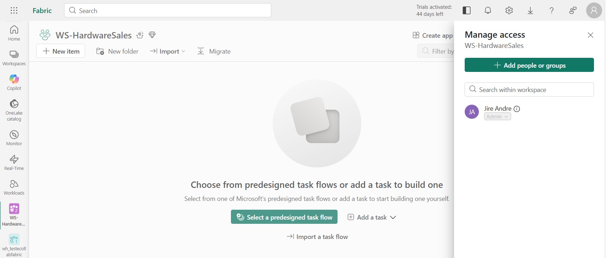
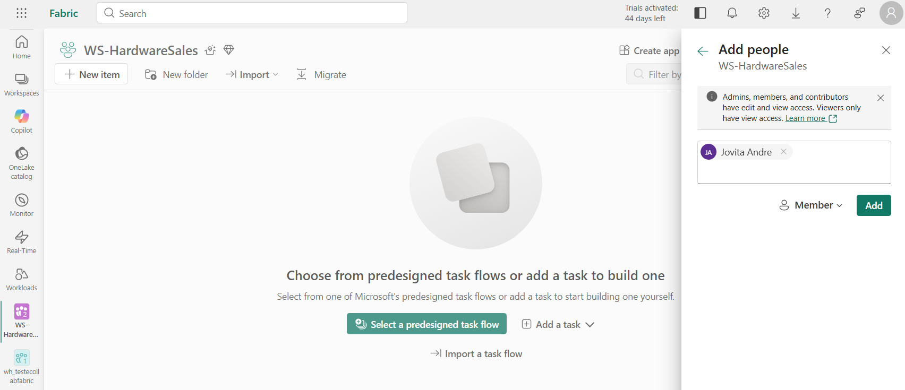
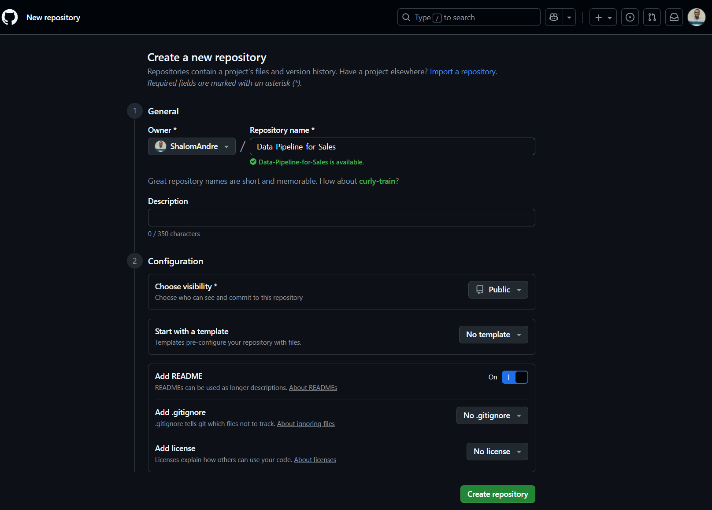
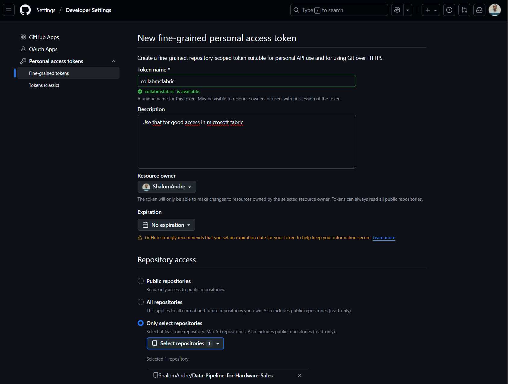
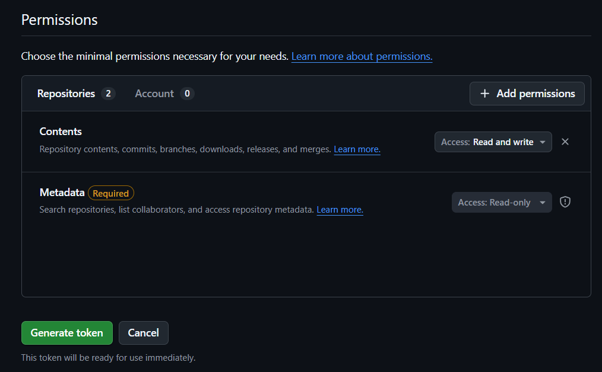
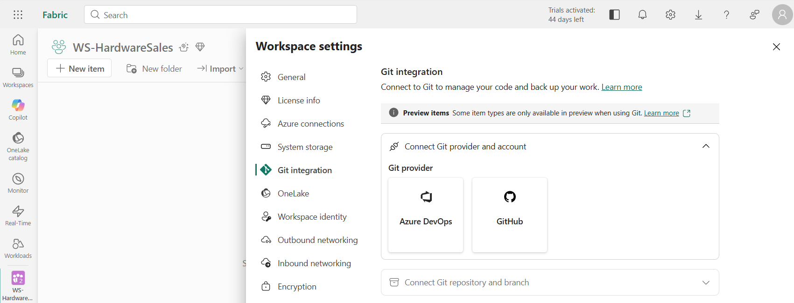
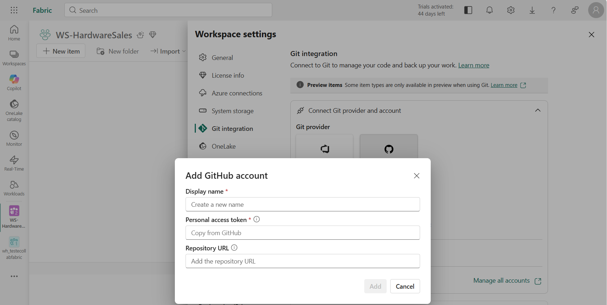

# Data Pipeline for Hardware Sales 📊

## 📖 Context
The company **TechStore** sells hardware equipment and maintains a sales history in a CSV file hosted on GitHub.  
The data team needs to transform this data into actionable insights using **Microsoft Fabric** and **Power BI**, ensuring **version control** and **collaboration** via **Git/GitHub**.

Two professionals will be involved:
- **Data Engineer**: responsible for data ingestion, transformation, and storage.
- **Data Analyst**: responsible for semantic model creation and report development.

---

## ⚙️ Problem
The raw CSV file is not ready for analysis:
- It contains non-standardized columns (e.g., price unit).
- It is not integrated into an analytical environment.
- incluia a imagem faltando a coluna!!
---

## 🎯 Objective
Create an automated pipeline that:
- Ingests data from GitHub into Microsoft Fabric.
- Transforms and stores it in the Lakehouse.
- Builds a semantic model for Power BI reports.
- Versions scripts and documentation in GitHub.

---

## 👨‍💻 Diagram

---

## 🚦Prerequisites
Before starting, make sure to:
1. **Active Microsoft Fabric account**.

   - account jire: data engineer

   - account jovita: data analyst

3. **Create a Workspace in Microsoft Fabric**:
   - Suggested name: `WS-HardwareSales`.

4. **Access Management**:
   - Add **Data Engineer** as **Admin** of the workspace.
     
   - Add **Data Analyst** as **Member** (with permission to create models and reports).
     
5. **GitHub Repository**:
   - Create repository: `Data-Pipeline-for-Sales`.
     
   
   - Create Token
     
   - Give permissions
     
   - Configure **Git Integration** in Microsoft Fabric:
     - In **Workspace Settings → Git Integration**, connect to the GitHub repository.
       
       
---

## 📋 Project Flow

### Phase 1: Data Engineer
**Ingestion**
- Connect **Dataflow Gen2** to the `HardwareSales.csv` file hosted on GitHub.
- Example URL:`https://raw.githubusercontent.com/TechStore/data-pipeline/main/HardwareSales.csv`

**Transformation**
- Create calculated column `UnitPrice` (e.g.: `UnitPrice = Total / Quantity`).

**Storage**
- Publish transformed data to the **Lakehouse** in the same Microsoft Fabric workspace.

---

### Phase 2: Data Analyst
**Semantic Model**
- Create the semantic model.

**Reports**
- Build dashboards:
- Total revenue per month.
- Top-selling products.

- Publish in the Microsoft Fabric workspace.

---

## Author

    
